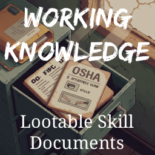

# Working Knowledge

A Project Zomboid Build 42 mod. Knox County is full of the working knowledge of people who aren't around to use it anymore — safety manuals, training guides, certification handbooks. Find one, read it, and carry a little of that forward.

## How It Works

Documents scattered across Knox County can each be read once per character. Reading one grants a flat XP boost toward the associated skill. The boost is modest, meant to supplement your experience rather than replace it. Once read, the document can be passed to another survivor.

## Finding Documents

Different documents appear in contextually appropriate locations — a fleet maintenance log turns up at a car dealership, not a hospital. Spawn rates are intentionally low; finding one should feel like a find.

## Design

See [DESIGN.md](DESIGN.md) for full product requirements — mechanic details, skill coverage philosophy, and spawning rules.

The specific documents, their associated skills, spawn locations, and flavor text are catalogued separately.

## Configuration

Both options are found under **Working Knowledge** in the Sandbox settings when creating a new game, or via **Sandbox** in an existing save's escape menu.

### Document Spawn Rate

Controls how often WK documents appear in loot containers.

| Setting | Multiplier | Effect |
|---|---|---|
| Very Rare | 0.25× | ~40 containers expected per document |
| Rare | 0.5× | ~20 containers expected per document |
| **Normal** | **1×** | **~10 containers expected (default)** |
| Common | 2× | ~5 containers expected |
| Abundant | 4× | ~3 containers expected |

Changing this setting mid-save only affects containers generated after the change — already-looted areas are not retroactively updated.

### XP Grant

The flat XP awarded when a document is read for the first time. Scaled by the game's passive skill multiplier. Default is **50**. Set to 0 to disable XP entirely while keeping documents as collectibles.

## Installation

1. Subscribe on the Steam Workshop *(link coming at release)*
2. Enable **Working Knowledge** in the Mods menu
3. Start or load a save

**Existing saves:** Documents will appear in any area you haven't visited yet. Containers that were already opened before the mod was added won't be affected — PZ spawns loot when a chunk is first loaded, not retroactively.

## Credits

Built with [Claude Code](https://claude.ai/code).
